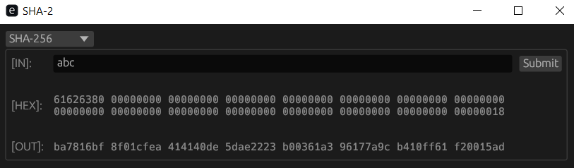

# JISP SHA-2

This crate is my implementation of SHA-2, this implementation is just my personal project and has not been officially verified or audited and should therefore not be used in any real-world applications, it is only meant for small personal projects such as mine. 

# Running the simple GUI
For demonstration purposes I have also made a simple User Interface


If you want to use this interface yourself you need to have the rust compiler [Cargo](https://www.rust-lang.org/tools/install) installed.

To execute this program you need to then clone this repository and run
```
cargo run -p jisp_sha2_gui
```
in the directory. Alternatively you can also use `cargo build` and then run the executable found in the `/target` folder

# Installing Crate
In order to use this crate in your own rust projects you need to add the following to your `Cargo.toml` file
```
[dependencies]
jisp_sha2 = "0.2.0"
```

# Documentation
Look at the [docs.rs](https://docs.rs/jisp_sha2/0.2.0) to learn more about how to use this project!
